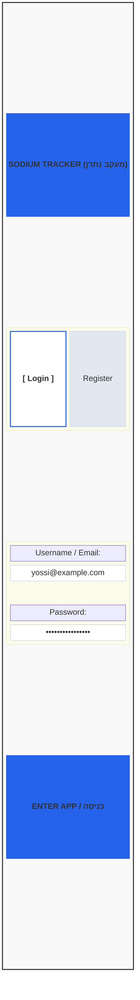
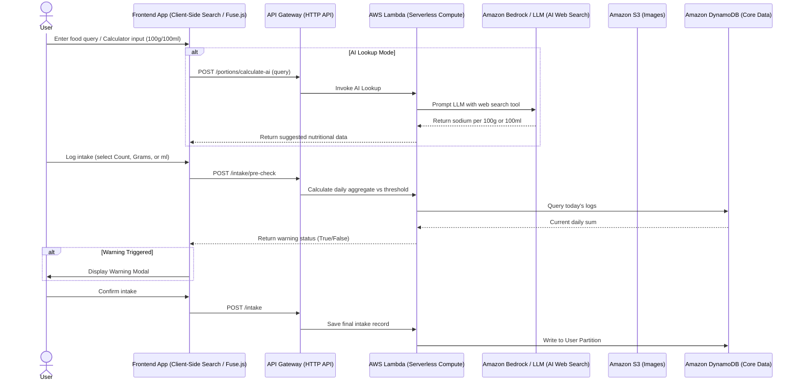

# **Application Specification & Technical Design: Sodium Tracker (נתרן)**

## **1\. Executive Summary & Overview**

The **Sodium Tracker** application is a serverless, mobile-first web app designed to monitor, calculate, and log daily sodium consumption. Key capabilities include a flexible unit portion calculator (supporting both 100g and 100ml baselines), manual and AI-assisted web lookups, local user management with encrypted authentication, a pre-check consumption warning system, multi-unit food intake logging (count, grams, or milliliters), and a hybrid private/shared food catalog equipped with image support and local fuzzy search.

## **2\. App Wireframes & Screen Workflows**

### **Screen 1: Authentication (Login / Register)**

`+---------------------------------------+`  
`|             SODIUM TRACKER            |`  
`+---------------------------------------+`  
`|                                       |`  
`|  [ Login ]          [ Register ]      |`  
`|                                       |`  
`|  Username / Email:                    |`  
`|  [ yossi@example.com                ] |`  
`|                                       |`  
`|  Password:                            |`  
`|  [ ******************               ] |`  
`|                                       |`  
`|              [ ENTER APP ]            |`  
`|                                       |`  
`+---------------------------------------+`

### **Screen 2: Dashboard & Daily Intake Tracker**

`+---------------------------------------+`  
`|  Hi, Yossi              [Settings/Out]|`  
`+---------------------------------------+`  
`|  TODAY'S SODIUM STATUS                |`  
`|  [==============] 1,850mg / 2,300mg   |`  
`|  Status: 80% of daily threshold       |`  
`+---------------------------------------+`  
`|  TODAY'S LOG HISTORY:                 |`  
`|  * Bamba (Small Bag) - 120mg          |`  
`|  * Cottage Cheese (100g) - 400mg      |`  
`|  * Tomato Soup (1 bowl) - 850mg       |`  
`+---------------------------------------+`  
`|  [ + LOG NEW FOOD INTAKE ]            |`  
`|  [ + OPEN PORTION CALCULATOR ]        |`  
`+---------------------------------------+`

### **Screen 3: Portion Calculator & Creator**

*Supports specifying unit bases by weight (100g) or volume (100ml).*  
`+-------------------------------------------+`  
`| < Back         PORTION CALCULATOR         |`  
`+-------------------------------------------+`  
`|  Portion Name:                            |`  
`|  [ Cookie                           ]     |`  
`|                                           |`  
`|  Input Mode:                              |`  
`|  (o) Manual Entry   ( ) AI Web Lookup     |`  
`|                                           |`  
`|  --- Manual Fields ---                    |`  
`|  Reference Basis:                         |`  
`|  (o) Per 100 Grams  ( ) Per 100 ml        |`  
`|                                           |`  
`|  Sodium per Reference Unit (mg):          |`  
`|  [ 450                              ]     |`  
`|                                           |`  
`|  Portion Base Unit Weight/Volume:         |`  
`|  [ 25 ] (g or ml per single item/portion) |`  
`|                                           |`  
`|  Calculated Sodium per Portion Unit:      |`  
`|  >>> 112.5 mg                             |`  
`|                                           |`  
`|  Tags (comma separated):                  |`  
`|  [ snack, bakery, sweet             ]     |`  
`|  Share with global community? [X]         |`  
`|  [ Upload Image ] (0 files selected)      |`  
`|                                           |`  
`|         [ SAVE TO MY PORTIONS ]           |`  
`+-------------------------------------------+`

### **Screen 4: Food Intake Logging (Multi-Unit Entry)**

*When logging an intake item, the unit options adapt dynamically based on how the food was defined.*  
`+---------------------------------------+`  
`| < Back         LOG FOOD INTAKE        |`  
`+---------------------------------------+`  
`|  Selected Item: Cookie                |`  
`|  (Defined as: 25g per single portion) |`  
`|                                       |`  
`|  Select Consumption Unit:             |`  
`|  (o) Count (Portions/Items)           |`  
`|  ( ) Weight in Grams                  |`  
`|                                       |`  
`|  Enter Amount:                        |`  
`|  [ 3   ] cookies                      |`  
`|                                       |`  
`|  Total Sodium for this Intake:        |`  
`|  >>> 337.5 mg                         |`  
`|                                       |`  
`|         [ PROCEED TO LOG ]            |`  
`+---------------------------------------+`

### **Screen 5: Pre-Check Warning Modal**

`+---------------------------------------+`  
`|         ⚠️ THRESHOLD WARNING          |`  
`+---------------------------------------+`  
`|  Adding **Cookie (337.5mg)** will     |`  
`|  bring your total to **2,187.5mg**.   |`  
`|                                       |`  
`|  This approaches your daily target of |`  
`|  **2,300mg** (95%).                   |`  
`|                                       |`  
`|  Do you still want to consume this?   |`  
`|                                       |`  
`|  [ CANCEL ]        [ YES, LOG ANYWAY ]|`  
`+---------------------------------------+`

## **3\. System Architecture & Component Interaction**

## **4\. Technical Appendix: Infrastructure & Software Stack Recommendations**

### **A. AWS Cloud Services (Infrastructure Stack)**

> 1. **Compute Layer: AWS Lambda**  
   * *Runtime:* Python 3.11 or Node.js 20.x, deployed as lightweight serverless functions handling authentication math, portion calculation scaling, intake aggregations, and AI prompt orchestration.  
> 2. **API Layer: Amazon API Gateway (HTTP APIs)**  
   * Provides high-performance, low-cost routing with native support for CORS and JWT/custom token authorizers executed via Lambda.  
> 3. **Primary Data Store: Amazon DynamoDB**  
   * *Table Schema Design (SodiumTrackerCore)*: Single-table layout minimizing reads/writes.  
     * PK (Partition Key): USER\#\<UserId\> or SHARED\#ITEMS  
     * SK (Sort Key): PROFILE, PORTION\#\<PortionId\>, or INTAKE\#\<YYYY-MM-DD\>\#\<EpochTime\>  
   * *Future Search Scalability:* Configured with **DynamoDB Streams** to stream item inserts/updates directly into **Amazon OpenSearch Serverless** if the shared global catalog outgrows client-side memory limits.  
> 4. **Storage Layer: Amazon S3**  
   * Hosts food item pictures uploaded safely using **S3 Pre-signed URLs** generated by the backend API, keeping heavy binary payloads off the Lambda execution memory space.  
> 5. **AI Integration: Amazon Bedrock**  
   * Utilizes managed foundation models equipped with live web-retrieval tools to fetch accurate raw sodium numbers per 100g or 100ml on demand.

### **B. Software Tools, Frameworks & Libraries (Application Stack)**

> 1. **Frontend Client:**  
   * **Framework:** React / Next.js or Flutter (Mobile-First responsive design layout).  
   * **Client-Side Search & Autocomplete:** **Fuse.js** or **FlexSearch** running entirely in-browser over a cached array of private and shared catalog items to deliver instant typo-tolerant fuzzy search without backend search cluster latency.  
> 2. **Backend Services & Security:**  
   * **Password Hashing:** bcrypt or Argon2 for secure application-level credential verification stored directly inside the DynamoDB user profile record.  
   * **Image Processing:** sharp (Node.js) or Pillow (Python) via S3 event triggers or pre-upload validation to handle picture thumbnails.